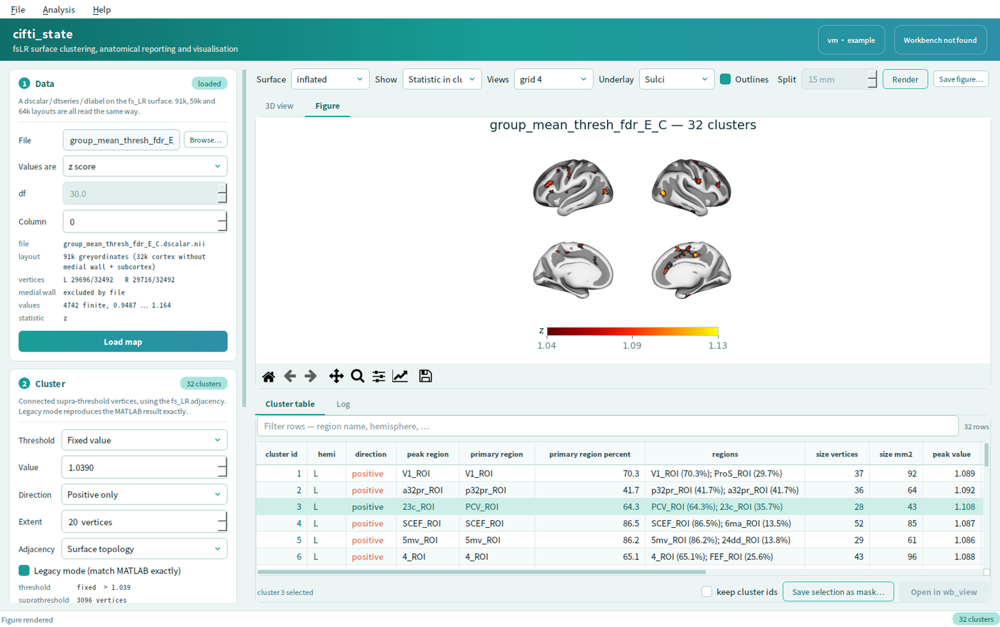
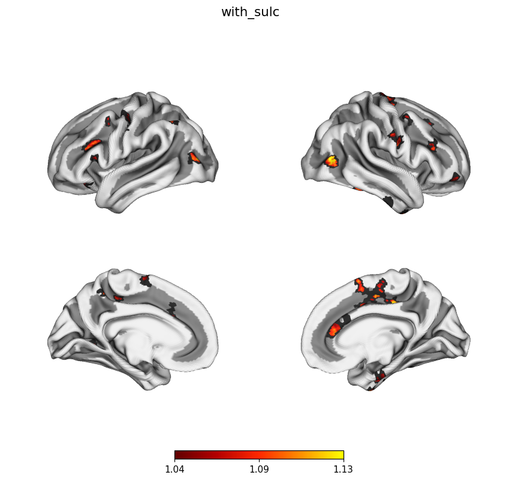
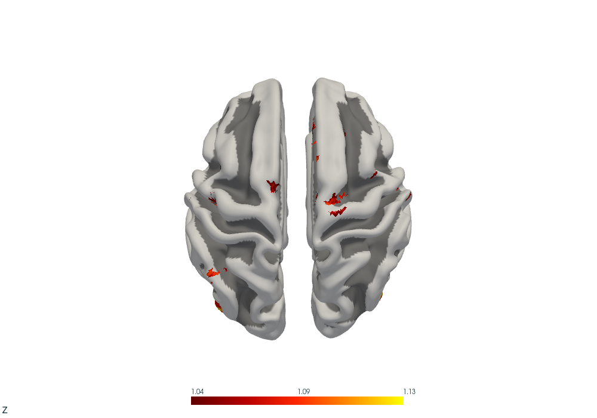
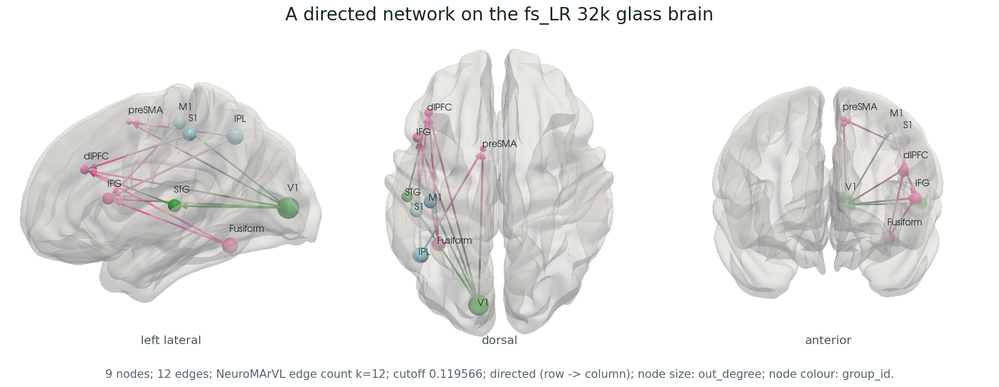
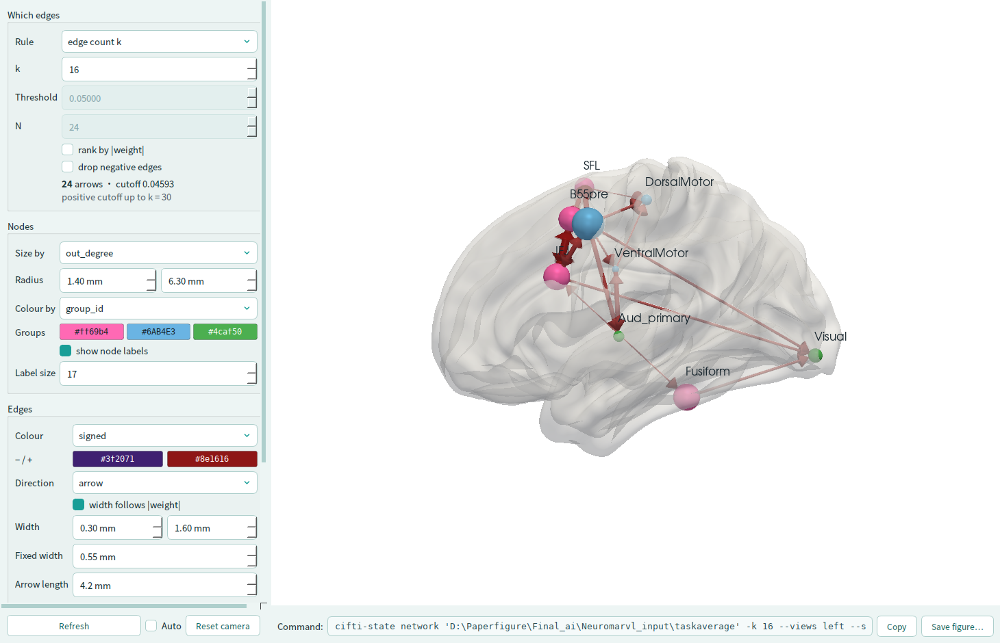

<div align="center">

# cifti_state

**fs_LR 32k 皮层表面的 cluster 分析、脑区报表与可视化。**

给一张皮层表面上的统计图，找出过阈值后的 cluster，标出它们落在哪些脑区，再把它们画出来——命令行、Python 接口、桌面界面三个入口，共用同一套核心函数。

[](https://www.python.org/)
[](LICENSE)
[](#测试)
[](#安装)

[English](README.md) · [中文](README.zh-CN.md)

</div>



---

## 它做什么

你手上有一张 fs_LR 32k 表面上的统计图——任何软件出的 z 图或 t 图都行。
这个工具把它变成你真正需要的那张表和那张图。

```
map.dscalar.nii  ──▶   阈值    ──▶  cluster  ──▶   峰值 + 图谱脑区   ──▶   表格
     91k/59k/64k     固定/FDR/       连通域        Glasser、AAL、Yeo、      csv/xlsx/md
                      百分位                        Schaefer、Desikan…       + 图
```

| | |
|---|---|
| **三种 fs_LR CIFTI 布局都能读** | 91k、59k、64k 说的都是同一套左右 32k 皮层。顶点映射从每个文件自己的 brain model 里读，不对灰坐标总数做任何假设——写回时也用你给的那种布局。GIFTI 半球对也支持。 |
| **不止一种分辨率** | fs_LR 10k 和 fsaverage5 能在自己的密度上跑完整个流程，而报表一律在图谱所在的 fs_LR 32k 上量、在那里命名——不同密度出来的表可以直接对比。`cifti-state resample` 通过 `wb_command` 在网格之间搬数据，球面配对、面积度量、内侧壁排除一样不落。 |
| **交代得清楚的 cluster** | 正向、负向、双向；以顶点数计的最小 extent；固定值、FDR、百分位三种阈值；编号是确定性的。每个结果都携带产生它的那份参数快照。 |
| **脑区名来自图谱本身** | 每个 `label.gii` 自带的 LabelTable 就是权威来源，按（半球，label id）索引——所以模板包里的图谱全都能用，不只是额外配了查找表的那几个。 |
| **老实的峰值表** | 峰值**和**均值各用各的名字，另加 SD、min/max、以 mm² 计的面积、峰值与质心坐标，以及每个 cluster 落在每个脑区的占比。 |
| **组水平统计，带校正** | 跨被试的单样本、双样本、配对 t 检验，可带协变量——然后在整个皮层上做族系错误率校正：随机场理论、置换检验和 TFCE **三套都给**，可以互相对照。TFCE 与 PALM 一致到机器精度。 |
| **三个入口，一套核心** | 命令行 `cifti-state`、notebook 里 `import cifti_state`、界面 `cifti-state-gui`，调的是同一批函数——界面能做的事都能写成脚本。 |
| **能出版的图 + 能转的 3D** | surfplot 负责导出的静态图，PyVista 负责可旋转的交互视图——同一批数组，都带沟回底板。 |
| **脑网络出图** | 玻璃脑 + 节点球 + **有向**连边，输入就是 NeuroMArVL 那四个文本文件——包括它的 edge count 规则（精确复现）和它存下来的 settings 文件。 |
| **clone 完就能跑例子** | `example_data/` 里既有数据也有最小模板文件。克隆、安装、直接跑。 |

这套东西最初是一组做同一件事的 MATLAB 函数；Python 版本是用
[Claude Code](https://claude.com/claude-code) 从它们出发整理写成的，
详见[引用与致谢](#引用与致谢)。

## 安装

<details open>
<summary><b>Windows</b></summary>

```bat
conda create -n cifti-state python=3.11 pip -y
conda activate cifti-state

git clone https://github.com/LASMpsyCAS/cifti_state_py.git
cd cifti_state_py

pip install -r requirements.txt
pip install -e .
```

`scripts\install_windows.cmd` 一步做完同样的事。
[`docs/INSTALL.md`](docs/INSTALL.md) 是十步走的完整实录，每条命令该看到什么输出都写了，
也包含国内 pip 镜像的设置。

</details>

<details>
<summary><b>Linux</b></summary>

```bash
conda create -n cifti-state python=3.11 pip -y
conda activate cifti-state

git clone https://github.com/LASMpsyCAS/cifti_state_py.git
cd cifti_state_py

pip install -r requirements.txt
pip install -e .
```

无头服务器上 VTK 需要离屏上下文——命令放在 `xvfb-run -a` 下跑，
或者装一个用 OSMesa/EGL 编译的 VTK。

</details>

> **为什么用 conda 建环境却用 pip 装包？** conda 解一整套科学计算栈要几分钟，
> pip 解同一套只要几秒。这里 conda 的唯一职责就是提供一个隔离的解释器。

有两个 wheel 很大（`vtk` 和 `PySide6`，各约 100 MB）。如果只要做分析，
单独 `pip install -e .` 只会拉 numpy/scipy/pandas/nibabel/matplotlib/PyYAML，
其余按需装：

```bash
pip install -e ".[viz]"        # surfplot 出图
pip install -e ".[gui]"        # 桌面界面和 3D 视图
pip install -e ".[all]"        # 全部，含测试工具
```

**Connectome Workbench 是可选的。** cluster、报表和两个渲染器都不需要它；
只有调用 `wb_command` 做数据操作、或者用 `wb_view` 打开结果时才用得上。

## 快速上手

仓库里自带了例子需要的全部文件，装完即可直接运行——不用下载，不用改路径。

```bash
export CIFTI_STATE_CONFIG=$PWD/example_data/example.yaml       # bash
# $env:CIFTI_STATE_CONFIG = "$PWD\example_data\example.yaml"   # PowerShell

cifti-state check                                              # 东西都齐了吗？

cifti-state run example_data/maps/group_mean_thresh_fdr_E_C.dscalar.nii \
    --method fixed --threshold 1.039 --extent 20 \
    --atlas Glasser_2016 --render -o results/E_C
```

```
loaded group_mean_thresh_fdr_E_C.dscalar.nii [91k greyordinates
      (32k cortex without medial wall + subcortex)]: L 29696/32492, R 29716/32492
found 32 clusters (left 15, right 17) at fixed(+1.039), extent >= 20
loaded atlas Glasser_2016 (360 regions across both hemispheres)

group_mean_thresh_fdr_E_C.dscalar: 32 clusters (L 15 / R 17)
  cluster_map      ..._cluster_extent20_thr1.039.dscalar.nii
  report_csv       ..._cluster_extent20_thr1.039_report.csv
  peaks_csv        ..._cluster_extent20_thr1.039_peaks.csv
  annotations_csv  ..._cluster_extent20_thr1.039_regions.csv
  figure           ..._cluster_extent20_thr1.039.png
  record           ..._cluster_extent20_thr1.039_analysis.json
```

这条命令应当得到的 cluster 图就放在输入旁边，可以直接核对你装的这份能不能精确复现：

```python
import numpy as np, nibabel as nib
name = "group_mean_thresh_fdr_E_C_cluster_extent20_thr1.039.dscalar.nii"
mine     = nib.load(f"results/E_C/{name}").get_fdata().ravel()
expected = nib.load(f"example_data/maps/{name}").get_fdata().ravel()
np.array_equal(mine, expected)      # True —— 0 个顶点不同
```

报表长这样：

| cluster_id | hemi | peak_region | primary_region | % | regions | size | mm² | peak | x | y | z |
|---|---|---|---|---|---|---|---|---|---|---|---|
| 1 | L | V1_ROI | V1_ROI | 70.3 | V1_ROI (70.3%); ProS_ROI (29.7%) | 37 | 92.0 | 1.089 | −19 | −56 | 0 |
| 2 | L | a32pr_ROI | p32pr_ROI | 41.7 | p32pr_ROI (41.7%); a32pr_ROI (41.7%) | 36 | 64.0 | 1.092 | −6 | 23 | 39 |
| 3 | L | 23c_ROI | PCV_ROI | 64.3 | PCV_ROI (64.3%); 23c_ROI (35.7%) | 28 | 43.0 | 1.108 | −7 | −45 | 51 |

然后试试另外两个入口：

```bash
python examples/worked_example.py        # 十步走，把本文所有说法都跑一遍给你看
cifti-state-gui                          # 界面
```

## 各种用例

<details open>
<summary><b>1 · 一条命令：阈值 → cluster → 报表 → 出图</b></summary>

```bash
cifti-state run map.dscalar.nii --method fixed --threshold 1.09 --extent 20
```

得到：cluster 标签图（`dscalar.nii`，布局与输入相同）、每个 cluster 一行的报表、
峰值表、逐脑区的标注表，以及一份记录参数的 JSON。加 `--render` 出图。

</details>

<details>
<summary><b>2 · FDR 阈值、双向、换图谱、导出 Excel</b></summary>

```bash
cifti-state run map.dscalar.nii \
    --method fdr --q 0.05 --direction two_sided \
    --extent 20 --atlas Desikan \
    --format xlsx --format csv --report-style long \
    --render --render-layout grid_8 --render-format pdf \
    -o results/fdr_two_sided
```

`--direction two_sided` 会同时找负向 cluster，编号与正向连续。
`--report-style long` 每个 cluster × 脑区一行，而不是把脑区挤进一个单元格。

</details>

<details>
<summary><b>3 · 输入是 t 图而不是 z 图</b></summary>

统计量类型必须声明，因为 p 值换算依赖它——把 t 图当 z 图读会悄悄低估 p 值。

```bash
cifti-state run tmap.dscalar.nii --statistic t --df 29 --method fdr --q 0.05
```

</details>

<details>
<summary><b>4 · 输入不在 fs_LR 32k 上</b></summary>

什么都不用设：密度是从文件里读的，整个流程就在那个密度上跑——邻接、cluster、出图。
报表则一律在图谱所在的 fs_LR 32k 上量、在那里命名，所以不同密度的表能直接比。

```bash
cifti-state run zmap_10k.dscalar.nii --method fixed --threshold 1.039 --extent 5
```

如果是要在网格之间搬数据：

```bash
cifti-state meshes                                  # 本机上有什么
cifti-state resample zmap.dscalar.nii --to fsaverage5 --nan mask
```

详见[在别的分辨率上工作](#在别的分辨率上工作)，
完整参考在 [`docs/MESHES.zh-CN.md`](docs/MESHES.zh-CN.md)。

</details>

<details>
<summary><b>5 · 一批图，一套参数</b></summary>

```bash
cifti-state batch "derivatives/*/stats/*_zstat.dscalar.nii" \
    --method fdr --q 0.05 --extent 20 --atlas Glasser_2016 \
    --format csv -o results/batch
```

每张图有自己的输出目录；其中一张失败不会中断其余的。

</details>

<details>
<summary><b>6 · 把一次运行记录下来，以便重跑</b></summary>

每次分析都会写出 `*_analysis.json`，里面是完整的参数集；分析也可以直接由 spec 文件驱动：

```yaml
# analysis.yaml
input_path: example_data/maps/group_mean_thresh_fdr_E_D.dscalar.nii
statistic: z
threshold_method: fixed
threshold_value: 1.09
direction: positive
extent: 20
atlas: Glasser_2016
top_n_regions: 2
output_dir: results/E_D
report_formats: [csv, xlsx]
render: true
```

```bash
cifti-state run --spec analysis.yaml
```

所有字段见 `examples/spec_example.yaml`。

</details>

<details>
<summary><b>7 · 对齐一份已经发表过的分析</b></summary>

有三个开关，是因为常规选择并不是唯一的选择，而一份既有结果可能是在别的选择下做出来的：

| 选项 | 钉住什么 |
|---|---|
| `--direction positive` | 只搜正尾，于是负向 cluster 不可能存活 |
| `--inf-policy legacy` | `±inf` 都映到最大有限值（而 `clip` 会把 `-inf` 送到最小值） |
| `fdr_legacy_tail: true` | 只有被检验那一侧的值参与 FDR 计算 |

`--legacy` 一次设定前两项：

```bash
cifti-state run map.dscalar.nii --method fixed --threshold 1.09 --extent 20 --legacy
```

输出文件名是 `<输入名>_cluster_extent<N>_thr<T>.dscalar.nii`，可以直接放进已有的目录结构。

</details>

<details>
<summary><b>8 · 跨被试比较两组，在整个皮层上做校正</b></summary>

用一个 CSV 描述这项研究——每次扫描一行，一列放文件路径，其余列随便写：

```csv
subject,group,age,sex,file
sub-01,patient,34,M,maps/sub-01_thickness.dscalar.nii
sub-02,control,29,F,maps/sub-02_thickness.dscalar.nii
...
```

```bash
cifti-state stats participants.csv --test two-sample --group group \
    --covariate age --covariate sex \
    --cluster-forming 3.1 --extent 20 \
    --permutations 5000 -o results/patients_vs_controls
```

```
two_sample: 28 observations, intercept + group[b] + age  [contrast: b - a, df=25]
  59412 vertices tested
  |t| max 5.848
  59412 vertices -> 608.0 resels (EC 2, FWHM 13.67 mm)
  peak FWE 0.05 at 5.750
  permutation peak FWE 0.05 at 5.699

8 clusters at t > 3.1, extent >= 20
 cluster_id hemi  size_vertices  size_resels   peak_t  p_rft_cluster  p_rft_peak  p_perm_cluster  p_perm_peak
          2    L            211         2.21     5.85         0.0021      0.0403          0.0040       0.0319
          5    R             53         0.88     5.05         0.2388      0.2330          0.6607       0.2176
          6    R             43         0.48     4.04         0.7712      1.0000          0.8044       0.8683
```

种进去的 blob 是 cluster 2，其余都是噪声，两套校正对此看法一致。
`--test one-sample` 和 `--test paired`（配 `--condition` 和 `--subject`）用同一套选项。
每一列是什么意思、该信哪一列，见[组水平统计](#组水平统计)。

</details>

<details>
<summary><b>9 · 桌面界面</b></summary>

```bash
cifti-state-gui                                  # 或：cifti-state-gui map.dscalar.nii
```

左侧三步：**Data**（选文件、声明 z 还是 t）→ **Cluster**（阈值、方向、extent）
→ **Anatomical report**（图谱、每个 cluster 报几个区、最小占比、表格版式）。
右侧上方是预览，下方是 cluster 表格和日志。

- 报表参数**只**重跑标注这一步。勾上 *Update as I change these*，表格就跟着控件实时更新，
  不用重新 cluster。
- 表格里选中若干行 → **Save selection as mask…**，把选中的 cluster 写成二值 `dscalar.nii`，
  **与输入同一种灰坐标布局**，可以直接回喂给任何流程。勾 *keep cluster ids* 则写各自的编号而不是 1。
- **Open in wb_view** 把 cluster 图写到临时目录，连同统计图和模板面一起调起 Workbench。
- 预览有两个页签：可旋转的 **3D view**，和导出用的 **Figure**——后者调的就是命令行用的那个函数。
- 所有耗时操作都在 worker 线程上，带进度条和 Cancel。

快捷键：`Ctrl+O` 打开 · `Ctrl+R` cluster · `Ctrl+D` 渲染 · `Ctrl+E` 导出报表 ·
`Ctrl+M` 存 mask · `Ctrl+W` wb_view。

</details>

<details>
<summary><b>10 · Python 接口——八行跑完整个流程</b></summary>

```python
from cifti_state import load_settings, run_analysis, AnalysisSpec

settings = load_settings("example_data/example.yaml")
spec = AnalysisSpec(
    input_path="example_data/maps/group_mean_thresh_fdr_E_C.dscalar.nii",
    threshold_method="fixed", threshold_value=1.039,
    extent=20, atlas="Glasser_2016",
    output_dir="results/E_C", report_formats=("csv", "xlsx"), render=True,
)
result = run_analysis(spec, settings)

print(result.summary())          # "32 clusters (L 15 / R 17) at fixed(+1.039) …"
result.report                    # 一个 pandas DataFrame
result.outputs                   # {"cluster_map": Path(...), "report_csv": Path(...), …}
result.to_json("run.json")       # 足以复现这次运行
```

</details>

<details>
<summary><b>11 · Python 接口——需要拆开用的时候</b></summary>

```python
from cifti_state import load_settings
from cifti_state.io import load_surface_stat_map, save_like, load_hemisphere_surfaces
from cifti_state.core import (compute_threshold, find_clusters, cluster_peaks,
                              annotate_clusters, build_report, clusters_mask)
from cifti_state.io.atlas import load_atlas
from cifti_state.pipeline import build_adjacency
from cifti_state.results import AnalysisSpec

settings = load_settings("example_data/example.yaml")

# 1 · 读取——布局是检测出来的，不是假设的
stat_map = load_surface_stat_map(
    "example_data/maps/group_mean_thresh_fdr_E_D.dscalar.nii", statistic="z"
)
stat_map.describe()
# {'layout': '91k greyordinates (32k cortex without medial wall + subcortex)',
#  'n_vertices_left': 32492, 'n_present_left': 29696, 'medial_wall_excluded': True, …}
stat_map.left.values        # (32492,) 完整网格上的值，文件没覆盖的地方是 NaN
stat_map.left.present       # (32492,) bool —— 文件实际带了哪些顶点

# 2 · 阈值
values = stat_map.finite_values()
thr = compute_threshold(values, method="fixed", value=1.09, direction="positive")
# 或  method="fdr", q=0.05, statistic="z", df=None
# 或  method="percentile", percentile=95
thr.describe(), thr.positive, thr.n_suprathreshold
# ('fixed(+1.09)', 1.09, 11634)

# 3 · cluster
adjacency = build_adjacency(stat_map, settings, AnalysisSpec(mesh="32k"))
clusters = find_clusters(stat_map, adjacency, thr, extent=20)
clusters.n_clusters, clusters.n_left, clusters.n_right     # (76, 38, 38)
clusters.labels_left        # (32492,) int，0 表示不属于任何 cluster
clusters.sizes()            # {1: 114, 2: 408, 3: 707, …}
clusters.info(3)            # ClusterInfo(cluster_id=3, hemisphere='left', …)

# 4 · 峰值与脑区
surfaces = load_hemisphere_surfaces(settings, "midthickness")
peaks   = cluster_peaks(stat_map, clusters, surfaces=surfaces)         # (76, 17)
atlas   = load_atlas("Glasser_2016", settings)
regions = annotate_clusters(clusters, atlas, peaks=peaks,
                            top_n=2, min_percent=5.0)                  # (147, 10)
report  = build_report(peaks, regions, style="wide")                   # (76, 21)

# 5 · 把选中的 cluster 写成 mask，布局与输入一致
left, right = clusters_mask(clusters, [3, 7, 12])      # label_values=True 保留编号
save_like("clusters_3_7_12.dscalar.nii", left, right, stat_map.template,
          map_name="clusters 3, 7, 12")
```

每一步都接受可选的 `progress=` 和 `cancel=` 回调——界面就是这样在 worker 线程上驱动它们的。

</details>

<details>
<summary><b>12 · Python 接口——出图与 3D</b></summary>

```python
from cifti_state.viz.render import render_stat_map, render_clusters, save_figure

fig = render_stat_map(
    stat_map, settings,
    clusters=clusters,
    mask_to_clusters=True,        # 只在存活的 cluster 内部显示统计值
    outline_clusters=True,        # 在上面描出 cluster 边界
    surface="inflated",
    layout="grid_4",              # grid_4 row_4 grid_8 dorsal_ventral
                                  # left_only right_only flat
    underlay="sulc",              # 灰度沟回底板
    colorbar_label="z",
)
save_figure(fig, "clusters.pdf", settings=settings, dpi=300)
```

`render_stat_map` 返回的就是一个普通的 matplotlib `Figure`——可以存盘，
也可以用 `FigureCanvasQTAgg` 把同一个对象嵌进 Qt 窗口。
界面里看到的和导出的来自同一条代码路径。



想要能转的：

```python
import pyvista as pv
from cifti_state.viz.interactive import build_scene

scene = build_scene(
    stat_map, settings, clusters=clusters,
    mode="masked",                # masked | full | clusters
    surface="inflated", split_mm=12, view="dorsal", underlay="sulc",
)
plotter = pv.Plotter()
scene.add_to(plotter)
plotter.show()
```

`build_scene` 返回的是与工具包无关的 `pyvista.PolyData` 网格加一份配色说明，
所以同一个场景既能交给脚本里的 `pyvista.Plotter`，也能交给界面里的 `pyvistaqt.QtInteractor`。



</details>

<details>
<summary><b>13 · 调用 Connectome Workbench</b></summary>

```python
from cifti_state.wb import probe, smooth_cifti, cifti_separate, open_in_wb_view

probe(settings)
# {'platform': 'windows', 'wb_command': 'D:/…/wb_command.exe',
#  'version': '1.5.0', 'available': True}

smooth_cifti("map.dscalar.nii", "smooth.dscalar.nii", settings,
             surface_kernel=4.0, volume_kernel=4.0)

cifti_separate("map.dscalar.nii", settings,
               left_metric="L.func.gii", right_metric="R.func.gii")

open_in_wb_view(["map.dscalar.nii", "clusters.dscalar.nii"], settings)
```

参数以列表传入，**从不经过 shell**；每次调用都完整记入日志，
所以出错时你能看到出错的那条命令本身。

</details>

## 配置：一台机器一个文件

机器之间不一样的只有路径，所以机器文件里也就只写路径。

```
configs/
  settings.windows.yaml          平台模板：文件命名约定 + 分析默认值
  settings.linux.yaml            （两者都不含任何机器路径）
  machines/
    <hostname>.yaml              ← 你的，用下面的命令生成
    example-linux-server.yaml    ← 服务器模板，复制改名
example_data/example.yaml        ← 针对自带数据的、完全自包含的配置
```

```bash
cifti-state config --init-machine     # 生成 configs/machines/<hostname>.yaml
cifti-state config --show-chain       # 看哪个文件生效、为什么
cifti-state check --workbench --render
```

```yaml
# configs/machines/my-laptop.yaml
extends: ../settings.windows.yaml

workbench:
  wb_command: D:/workbench/bin_windows64/wb_command.exe
  wb_view:    D:/workbench/bin_windows64/wb_view.exe

resources:
  root:      D:/data/fs_LR_32-master      # 模板包
  atlas_dir: D:/data/fs_LR_32-master
  neighbors:
    "32k":
      left:  D:/data/lh.neighbors_IndexStart0.txt
      right: D:/data/rh.neighbors_IndexStart0.txt
```

**解析顺序**，先命中者胜：`--config` → `$CIFTI_STATE_CONFIG` →
`configs/machines/<hostname>.yaml` → 用户级配置 → `configs/settings.<platform>.yaml`。

几个值得知道的行为：

- 机器档案里**留空的值是继承**，不是清空。所以脚手架生成的半空文件可以直接用，
  不需要改的行删掉即可。
- 相对路径按**写下它的那个文件**所在目录解析，父子模板不会为工作目录打架。
- Windows 盘符路径（`D:/…`）在 Linux 上读也不会被悄悄改写——跨平台检查配置是安全的。
- 集群上各节点 hostname 不同但路径相同时，设 `CIFTI_STATE_MACHINE=shared`，
  档案命名为 `shared.yaml`。

## 输入格式

| 灰坐标数 | 是什么 | medial wall |
|---|---|---|
| **91282** | 皮层 29696 + 29716，外加 19 个皮层下结构 | 排除 |
| **59412** | 只有皮层，同样的顶点 | 排除 |
| **64984** | dense surface，32492 + 32492 | 包含 |

三者说的都是同一套左右 32k 皮层，处理是透明的：顶点映射来自每个文件自己的 brain model。
下游拿到的一律是完整网格数组加一个 `present` 掩码，所以顶点索引与曲面、图谱天然对齐，
不需要额外记账——输出也按输入自身的布局写回。

一对 `*.func.gii` 度量文件可以用 `load_surface_stat_map_from_gifti` 读入。
其他网格密度现在也是同样的机制，只要模板对得上——见[路线图](#路线图)。

**邻接**有两个来源：邻接表文件（`neighbor_source: txt`，每个顶点一行），
或者曲面网格本身（`neighbor_source: surface`）。
两者在 fs_LR 32k 上是同一个图——逐顶点核对过，32480 个顶点 6 邻居、12 个顶点 5 邻居——
而走网格不需要额外文件，所以自带例子用的就是它。

## 图谱

```bash
cifti-state atlases          # 你的模板包里有哪些
cifti-state atlases --all    # 连没登记进 registry 的也列出来
```

脑区名来自每个 `label.gii` 自带的 LabelTable，所以只要符合
`<name>.32k.{L,R}.label.gii` 命名约定的图谱**都能用**——Glasser 2016、AAL、Yeo 7/17、
Schaefer、Gordon、Power、Desikan、Destrieux、Fan、Shen、Baldassano、Wang、
各种 Icosahedron，以及模板包里的其余图谱。标签按（半球，label id）索引，
所以两个半球复用同一段 id 的图谱不需要任何偏移就能正确处理。
配了 CSV 的，CSV 作为显示名覆盖叠在上面。

## 组水平统计

前面所有内容的起点，都是别人已经算好的统计图。这一部分负责把它算出来——
跨被试的顶点级模型——然后告诉你其中有多少经得起整个皮层范围的校正。

### 描述这项研究

一个 CSV 或 TSV，每次扫描一行，一列放该次扫描的图的路径，其余列随便写。
相对路径按表自己所在的目录解析，所以整个研究目录可以随便搬，不用改任何东西。

```csv
subject,group,condition,age,sex,file
sub-01,patient,pre,34,M,maps/sub-01_pre.dscalar.nii
sub-01,patient,post,34,M,maps/sub-01_post.dscalar.nii
sub-02,control,pre,29,F,maps/sub-02_pre.dscalar.nii
...
```

### 三种检验

| 检验 | 问什么 | 行是怎么用的 |
|---|---|---|
| `--test one-sample` | 均值图是否不等于零？ | 每一行是一个观测 |
| `--test two-sample --group G` | 两个独立组是否有差异？ | 按 `G` 分组；对比是**后者减前者**，谁是前者谁是后者会打印出来，不交给字母序去碰运气 |
| `--test paired --condition C --subject S` | 同一批被试的两次测量是否有差异？ | 按 `S` 配对；数据变成差值，模型就是对差值做单样本检验 |

`--covariate age --covariate sex` 加入协变量。连续协变量会**去均值**
（于是单样本的截距意思是「平均年龄处的均值」，而不是「年龄为零时的值」）；
分类协变量做哑变量编码。实际拟合的模型会回报给你：

```
two_sample: 28 observations, intercept + group[b] + age  [contrast: b - a, df=25]
  - covariate age mean-centred at 32.5
  - group sizes: a n=14, b n=14
```

双样本可以用 `--variance welch` 去掉等方差假设。此时自由度逐顶点变化，
所以校正前会把图转成 z——这件事会写在结果里，不会偷偷做掉。

### 有多少是真的：三套校正

两者都控制整个皮层范围的族系错误率。它们依赖的假设不同，
所以两套都跑、再互相对照，是你能买到的最便宜的信心。

**随机场理论**先测这个场有多平滑——从模型的**残差**来测，
因为残差是整个分析里唯一纯粹是噪声的东西——再问：
这么平滑的一张零假设图，会冒出什么样的东西。计量单位是 resel，
即一个 FWHM 见方的小块：

```
59412 vertices -> 608.0 resels (EC 2, FWHM 13.67 mm)
peak FWE 0.05 at 5.437
```

**置换检验**换一条路：在零假设下重排数据。
单样本和配对用符号翻转，双样本用打乱分组标签，
并用 Freedman–Lane 残差化让协变量结构在重排中存活下来。
它对分布和平滑度都不作假设。被试足够少时会穷举所有重排，检验就是精确的。

```bash
--permutations 5000        # 整个皮层上大约每千次一分钟
```

于是每个 cluster 最多拿到五个 P 值，它们回答的是不同的问题：

| 列 | 层级 | 含义 |
|---|---|---|
| `p_rft_peak` | 峰值级 | 这个 cluster 的最高顶点，校正后——是关于**那个顶点**的证据 |
| `p_perm_peak` | 峰值级 | 同上，来自置换的最大统计量零分布 |
| `p_rft_cluster` | cluster 级 | 这个 cluster 以 resel 计的范围，校正后 |
| `p_perm_cluster` | cluster 级 | 同上，来自置换的最大范围零分布 |
| `p_tfce` | 顶点级 | 这个 cluster 里 TFCE 最高的那个顶点，校正后——见下 |

cluster 级证据允许你说「这一团里有事情发生」，绝不允许说「这个顶点显著」。
峰值级证据反过来。

### TFCE：不必再挑阈值

上面每一个数都依赖成簇阈值，而换个阈值答案就会变：
阈值低偏向大而弥散的效应，阈值高偏向局灶的峰，
而对一个你还没看到的效应，没有任何东西能告诉你哪个才对。
无阈值成簇增强（TFCE）的办法是把所有阈值都积分掉。每个顶点的得分是

```
TFCE(v) = ∫ e(h)^E · h^H dh
```

其中 `e(h)` 是在高度 *h* 上包含顶点 *v* 的那个超阈值 cluster 的范围。
一个顶点因为「站得高」（`h^H`）得分，也因为「属于一大片」（`e(h)^E`）得分，
所以又矮又宽的一片和又高又窄的一根都有可能胜出。
在皮层面上，这里的范围是**以 mm² 计的面积**，不是顶点个数——
网格疏密不均，绝不能让恰好剖分得更密的区域白占便宜。

```bash
--tfce            # PALM 的默认值，H=2 E=0.5
--tfce-2d         # PALM 的 -tfce2D，H=2 E=1，它的文档对面数据建议用这个
--tfce-H 2 --tfce-E 1 --tfce-dh 0.1     # 或者自己定
```

TFCE 自己没有零分布，所以只有配合 `--permutations` 才能成为检验；
不带置换而要 TFCE，你会拿到那张图，外加一句警告说它是拿来看的、不是检验。
输出多两个文件——得分图，以及一整张逐顶点的 FWE 校正 P 值图，
里面从头到尾没有任何成簇阈值：

```
  TFCE (H=2, E=1, dh=auto (max/100)): 4 vertices at corrected P<=0.05

 cluster_id hemi  size_vertices  peak_t  p_rft_cluster  p_perm_cluster   peak_tfce  p_tfce
          2    L             81   4.043          0.029           0.064     7300.57   0.050
          3    L             50   4.693          0.250           0.486     3761.96   0.706
          1    L             49   4.954          0.382           0.512     2366.29   0.982
          4    L             22   3.661          0.697           0.984     1944.61   0.998
```

注意 cluster 1：四个里峰最高的那个，按 TFCE 只排第三。
光靠高度没能把它抬起来——这正是这个统计量该有的样子。

**与 PALM 的一致性。** 这是对 `palm_tfce.m` 的重新实现，
而且是拿真家伙对拍的，不是照着描述写的：
PALM 那个函数在 GNU Octave 里跑了四套网格——大小不同、有掩膜和无掩膜、
三组 H 和 E——两边一致到 **1e-15 相对误差**，也就是机器精度。
这些参考向量已经随仓库提交（`tests/data/palm_tfce_reference.npz`），
对拍就在普通测试里跑。哪些细节必须对上，写在
`cifti_state/stats/tfce.py` 里，连同那一处有意的偏离：
PALM 也接受固定的 `-tfce_dh`，但它的皮层面分支从来没给最后要乘的那个 `dh` 赋值，
所以那条路在 PALM 自己里就会报错；这里的 `--tfce-dh`
是照 PALM **体数据**分支的做法实现的。

在 fs_LR 32k 皮层上每张图约 0.2 秒——也就是每千次重排约 3.5 分钟，
这是在置换循环本身之外的开销。

### 它们校准得怎么样？

是测出来的，不是假设的。零数据平滑到 fs_LR 32k 上约 11 mm FWHM，
单样本检验，成簇阈值 3.1，名义族系错误率 0.05：

| 校正 | 实测 FWE | |
|---|---|---|
| RFT 峰值级 | **0.040** ± 0.017 | 与承诺一致 |
| 置换 峰值级 | **0.042** ± 0.036 | 与承诺一致 |
| 置换 cluster 范围 | **0.058** ± 0.042 | 与承诺一致 |
| RFT cluster 范围 | **0.158** ± 0.032 | 偏松 |
| RFT cluster 范围，高斯闭式解 | 0.206 ± 0.035 | 更糟——所以它不是默认 |

（RFT 那几行是 n=28 跑 500 次重复，置换那两行是 n=24 跑 120 次重复 × 200 次重排；
± 是对模拟本身的 95% 区间。用 `examples/make_example_study.py --effect 0`
加你自己的循环就能复现。）

峰值级和置换的结果都是该有的样子。RFT 的 cluster 范围不是，
而中间量说明了原因：cluster 的**数量**期望值准到几个百分点以内
（实测 9.71，预测 9.39），但真实 cluster 比理论预期大 25–35%，
因为过阈值的顶点更容易落在这个场恰好局部更粗糙的地方。
这是参数化 cluster 范围推断的已知局限（Eklund, Nichols & Knutsson 2016），
不是这里的实现缺陷——这些公式与 SurfStat 的对拍精度约为千分之一，
直接拿 [BrainStat](https://github.com/MICA-MNI/BrainStat) 核对过。

TFCE 是单独测的，为了让 200 次零假设重复 × 500 次重排跑得起来，
搜索区域小一些（40 × 40 的格点，FWHM 4，n=16，名义 0.05，± 是对模拟本身的 95% 区间）：

| 校正 | 实测 FWE | |
|---|---|---|
| TFCE，H=2 E=0.5（PALM 默认） | **0.030** ± 0.030 | 与承诺一致 |
| TFCE，H=2 E=1（`--tfce-2d`） | **0.035** ± 0.030 | 与承诺一致 |
| 置换 峰值级 | 0.050 ± 0.030 | 同一次运行，作参照 |
| 置换 cluster 范围 | 0.045 ± 0.030 | 同一次运行，作参照 |

**所以：峰值级 RFT 可以放心报；cluster 级结论请以置换或 TFCE 的 P 值为准。**
不带 `--permutations` 跑 `cifti-state stats` 时，它也会这么警告你。

### 从 Python 调用

```python
from cifti_state import load_settings
from cifti_state.stats import load_participants, two_sample_t

settings = load_settings()
people = load_participants("study/participants.csv")

analysis = two_sample_t(
    people, settings, "group",
    covariates=["age", "sex"],
    permutations=5000, cluster_forming=3.1, extent=20,
    tfce=True,             # 或者 tfce_settings=PALM_2D，即 H=2、E=1
)
print(analysis.summary())

analysis.stat_map          # 一个普通的 SurfaceStatMap——可以 cluster、出报表、出图
analysis.smoothness        # resels、以 mm 计的 FWHM、逐顶点 resel 密度
analysis.random_field      # RFT 下的峰值和 cluster P 值
analysis.permutation       # 最大统计量、最大范围和最大 TFCE 的零分布
analysis.tfce              # TFCE 得分，逐顶点一个值
analysis.tfce_p            # 逐顶点的 FWE 校正 P 值，全程没有任何阈值
analysis.tfce_stat_map()   # 这两张都能变成 SurfaceStatMap，直接拿去画
analysis.to_json("run.json")
```

统计图就是一个普通的
[`SurfaceStatMap`](#输入格式)，所以 cluster、脑区报表、出图和界面都能直接拿去用，
不需要知道它是从哪来的：

```python
from cifti_state.core import compute_threshold, find_clusters
from cifti_state.pipeline import build_adjacency
from cifti_state.results import AnalysisSpec

threshold = compute_threshold(analysis.stat_map.finite_values(),
                              method="fixed", value=3.1, direction="two_sided",
                              statistic="t", df=analysis.dof)
adjacency = build_adjacency(analysis.stat_map, settings, AnalysisSpec(mesh="32k"))
clusters = find_clusters(analysis.stat_map, adjacency, threshold, extent=20,
                         direction="two_sided")

analysis.correct_clusters(clusters)      # 一个带那四列 P 值的 DataFrame
```

### 手上没有数据也能试

仓库没法随包分发一整队被试，但随包分发了一个生成器：

```bash
python examples/make_example_study.py --out study --effect 0.9
python examples/make_example_study.py --out study_paired --paired --effect 0.7
python examples/group_stats_example.py --study study --paired-study study_paired
```

它会在一组里种进一个已知大小的 blob，然后把三种检验、平滑度估计和两套校正
走一遍，每一步都把结果打出来。想看校正什么都不该找出来的样子，
用 `--effect 0` 生成一个零假设研究。

## 沟回底板

两个渲染器都会在统计图下面画出灰度的沟回形态，这样一个 blob 是落在脑回顶上还是沟底，
一眼就能看出来，而不是浮在一个没有特征的壳上。

```yaml
render:
  underlay: sulc            # sulc | curvature | none
  underlay_style: binary    # binary（Workbench 风格）| continuous
  underlay_orient: auto     # auto | negative | positive
  underlay_dark: 0.38
  underlay_light: 0.72
```

底板的哪个符号代表**沟**并不是常数——FreeSurfer 的 `?h.sulc` 正值在沟里，
而 fs_LR 的这个文件负值在沟里——搞反了整张图会里外颠倒，偏偏看上去还挺像回事。
所以这里是测出来的，不是猜的：从曲面网格算出凹凸度，再据此决定灰度方向。
万一自动判断错了，用 `underlay_orient` 钉死。

## 字体与编码

字体在 Python 里定死，不交给桌面环境：按一份明确的优先级列表去找，
然后把同一个答案同时给 Qt 和 matplotlib，这样窗口和图不会各写各的。
`axes.unicode_minus` 关掉了（matplotlib 默认的 U+2212 在很多中文字体里缺字形，
会画成方框——负数显示不对多半就是这个原因），stdout 强制 UTF-8，
免得中文路径在 GBK 的 Windows 控制台上抛 `UnicodeEncodeError`。

字号用**像素**、只在一处定义，样式表读同一个数，
所以桌面的 DPI 缩放不可能只放大文字而不放大它所在的框。
数字输入框另外用等宽字体和 **C locale**，区域设置就不可能把本地数字或逗号小数点塞进阈值里。

**如果数字显示成了别的字符**——`0.1160` 变成 `O.ıı ϗ OO`——
那是字符串没错而字体错了：某些字体（Qt DirectWrite 后端下的 variable font、
损坏的子集字体）会把字符映到不属于它的字形上。这类字体族现在会被自动跳过，另外：

```bash
cifti-state check --fonts                      # 看解析结果
cifti-state check --fonts --sample spec.png    # 同一串数字在每个候选字体族里各画一行
```

想一劳永逸，就在机器档案里指定：

```yaml
interface:
  ui_font: Microsoft YaHei UI    # 中英兼顾
  mono_font: Consolas
  font_size_px: 13
  numeric_font: mono             # mono | ui
```

把 `.ttf`/`.otf` 丢进 `resources/fonts/`，结果就完全不依赖机器了——
自带字体会注册进两个工具包，并且优先级高于任何已安装的字体。

## 3D 视图是空白的怎么办

```bash
python examples/check_3d.py              # 或加 --offscreen，改成存 PNG
```

它自底向上逐层测试——imports、OpenGL 上下文、裸的 PyVista 窗口、你自己的皮层，
最后是界面用的 Qt 内嵌控件——并停在第一个失败的地方，
所以你知道是*哪一层*坏了，而不用猜。最常见的答案是 VTK 拿不到 OpenGL 上下文：
远程桌面一般给不了，显卡驱动太老也可能给不了。Figure 页签不需要它。

## 在别的分辨率上工作

fs_LR 32k 是默认，不是硬性要求。

> **完整参考：**[`docs/MESHES.zh-CN.md`](docs/MESHES.zh-CN.md)——
> 所有网格、所有配置项、所有命令行选项、所有 Python 接口、
> 每条报错是什么意思，以及一个真实数据上的完整例子。下面这一节是导览。
别的网格上的图会**在它自己的密度上**跑完整个流程——
邻接、cluster 面积、峰值坐标、图谱、出图——而且一个网格上的图可以搬到另一个网格上去。

### 网格怎么命名

一个网格是一对信息：**多少个顶点**，以及这些顶点是在**哪个配准空间**里对齐的。
这不是咬文嚼字——fs_LR 10k 和 fsaverage5 每半球都是 10 242 个顶点，
却是完全不同的两个面。一个长度 10 242 的数组并不说明自己是哪一个，
所以这个包**从不猜**：

```
fsLR:32k     每半球 32 492 顶点   （直接写 "32k" 也是指它）
fsLR:10k          10 242
fsLR:59k          59 292        ← 是更密的网格，不是 59 412 灰坐标那个布局
fsLR:164k        163 842
fsaverage4         2 562        fsaverage5   10 242
fsaverage6        40 962        fsaverage   163 842
```

```bash
cifti-state meshes            # 哪些网格的模板文件在本机上找得到
cifti-state meshes --routes   # 哪些之间可以互转
```

顶点数有歧义时，分析会**停下来问**，而不是挑一个空间、给出一张看起来完全正常的错图。
`defaults.mesh`（或 `--mesh`）用来定夺。

### 转换

```bash
cifti-state resample sub-01_bold.dtseries.nii --to fsLR:10k
cifti-state resample zmap.dscalar.nii --to fsaverage5 --nan mask -o zmap_fs5.dscalar.nii
```

```
fsLR:32k -> fsaverage5 [ADAP_BARY_AREA], 1 map(s), medial wall excluded, ROI-masked
  output  zmap_fs5.dscalar.nii
```

底下就是 `wb_command -metric-resample ... ADAP_BARY_AREA`，
也就是 HCP 用的、领域里公认的那个。这个包做的是它**周围**的事，
而恰恰是这些地方最容易出错：

| | |
|---|---|
| **球面选对** | fs_LR → fs_LR 用各自的球面；fs_LR → fsaverage 一边用 `fs_LR-deformed_to-fsaverage`，另一边用 fsaverage 标准球面。配错了，出来的图光滑、看着合理，但相对解剖是转过的。 |
| **面积度量** | `ADAP_BARY_AREA` 不给 `-area-metrics` 会悄悄退化成接近普通重心插值。这里它**从不可选**：没有面积度量的网格不能作为转换的一端，而且会明说是哪个文件缺了。 |
| **内侧壁** | 91k / 59k 文件那里本来就没数据。不给 `-current-roi`，缺失的壁会渗进旁边的顶点——错的恰好是皮层最薄、cluster 最常落的那一圈。 |
| **NaN** | 阈值化的图用 NaN 表示"没过阈值"，而插值会把每个 NaN 摊到它整个邻域上。随包的例子图从 32k 转到 10k：默认 **8.0% → 1.3%**，加 `--nan mask` 是 **8.0% → 6.7%**。 |
| **标签图** | 网络掩膜、分区图里存的是**标签编号**，取平均会在 3 号和 5 号中间造出一个 4 号。整数取值、层级又不多的图会被识别出来，每个目标顶点取覆盖它最多的那个标签——就是 `wb_command` 的 `-largest`，只不过扩展到了以普通 dscalar 保存的分区图。`--continuous` 可以强制回到取平均。 |
| **路由** | fs_LR 10k 没有 fsaverage 变形球面，所以 `fsLR:10k → fsaverage5` 一步走不了。它会经 fs_LR 32k 走两步，而多出来的那次插值会**报告出来**，不藏着。 |

每一条 `wb_command` 都记着，`--print-commands` 可以打出来——
结果可疑时可以自己复现一遍。

一次往返是能同时抓住上面所有问题的检验：光滑场 fs_LR 32k → 10k → 32k
回来的相关是 **r = 0.9995**，测试里就断言了这一条。
二值网络掩膜走同一条往返，Dice = **0.998**——20 484 个顶点里变了三个。

那个歧义不是假想出来的。一张每半球 10 242 顶点的个体语言网络掩膜，
**按 fs_LR 10k 读**，落在 TPOJ1、STSdp、STSda、A5、STGa、55b、PSL 上；
**同一个文件按 fsaverage5 读**，落在 V1、梭状回和中央后回——
一张散点似的、没有解剖结构的图。两个答案都像脑图，但只有一个是语言网络。
这就是 `identify_mesh` 宁可报错也不挑一个的原因。

### 模板：不用写一大堆配置

模板文件的名字本来就稳定而且自解释——
`fs_LR.32k.L.sphere.surf.gii`、`fsaverage5_std_sphere.L.10k_fsavg_L.surf.gii`、
`S900.L.midthickness_MSMAll.10k_fs_LR_va.shape.gii`——
所以配置里列的是**目录**，不是文件：

```yaml
resources:
  root: fs_LR_32k
  mesh_dirs: [fs_LR_32k, 10k, resample_fsaverage]
```

缺什么会指名道姓地说，连同它是做什么用的、去哪些目录找过。
名字不合惯例的文件可以在 `resources.mesh_files` 里直接钉死。
搜索**不递归**，也跳过 `old_` / `fix_` 前缀——
因为 HCP 的 `resample_fsaverage/misc/` 里放的是被取代的旧球面，
用错了会得到一个看起来完全正常的错误答案。

### 流程跟着数据走

```bash
cifti-state run zmap_10k.dscalar.nii --method fixed --threshold 1.039 --extent 5
```

```
loaded zmap_10k.dscalar.nii [18722 greyordinates]: L 9362/10242, R 9360/10242
input is on fsLR:10k (10242 vertices per hemisphere)
resampling atlas Glasser_2016 from fsLR:32k to fsLR:10k
found 40 clusters (left 22, right 18) at fixed(+1.039), extent >= 5
```

密度是从文件里读出来的。邻接、阈值、cluster 和出图都在那个密度上做，
用那个网格自己的曲面，沟回底板也会重采样过去。

**但报表出在 fs_LR 32k 上。** 图谱是按 32k 发布的，
把一个 180 区的分区图**往下**转到 10k，整块脑区只剩几个顶点，
逐区百分比就跟着变粗。所以是把跑完的 cluster **往上**送——
`wb_command -label-resample … -largest`，每半球一次——在那里量、在那里命名。
这样不管分析在什么密度上做，一张表的含义都一样。

怎么分，按每个数是什么来定：统计量的值（`peak_value`、均值、SD、min、max）
留在分析密度上，因为那是数据本身；面积、坐标、`peak_vertex` 和所有脑区列
来自 fs_LR 32k。另有一列 `size_vertices_native` 保留 `--extent` 阈值
实际作用的那个顶点数。cluster 图两个网格上各写一份，表才有东西可核对。
想让每张报表都在自己密度上量，设 `report_mesh: native`（或 `--report-mesh native`）。

细节见 [`docs/MESHES.zh-CN.md`](docs/MESHES.zh-CN.md#报表一律出在-fs_lr-32k-上)。

### 从 Python 调用

完整接口在 [`docs/MESHES.zh-CN.md`](docs/MESHES.zh-CN.md#8-python-接口)，
这里是它大概的样子：

```python
from cifti_state import load_settings
from cifti_state.mesh import MeshLibrary, plan_route, resample_cifti

settings = load_settings()
print(settings.mesh_library().report())        # 本机上有哪些网格可用

result = resample_cifti("zmap.dscalar.nii", "zmap_10k.dscalar.nii",
                        "fsLR:10k", settings, nan="mask")
print(result.describe())
result.commands            # 每一条 wb_command，可以直接粘到终端里
result.warnings            # 两跳路由、NaN 处理、缺 atlasroi 之类
```

### 为什么不用 neuromaps？

[neuromaps](https://github.com/netneurolab/neuromaps) 解的是同一个问题，做得也好，
但它的面数据变换底下调的就是同一批 `wb_command`——
它多出来的价值是从 OSF 下载模板文件。而这些文件本来就在这儿了。
所以默认后端直接调 Workbench：少一个依赖、不用下载（在连不上 OSF 的机器上这点很要紧）、
调用链看得见。想用它的图谱管理，传 `backend="neuromaps"` 即可。

## 脑网络出图

统计图回答的是「在哪儿」；连接矩阵回答的是「在什么和什么之间、朝哪个方向」。
`cifti-state network` 把后一种画在同一张 fs_LR 32k 表面上：半透明玻璃脑、
按属性决定大小和颜色的节点球，以及带箭头的**有向**连边。



> **完整参考：**[`docs/NETWORK.zh-CN.md`](docs/NETWORK.zh-CN.md)——每一个选项、
> 每一种模式、选边规则的准确定义和它是怎么验证的、Python 接口，以及每条警告是什么
> 意思。下面这一节是导览。

```bash
python examples/network_example.py     # 六张图，不需要任何数据
```

**输入格式、选边规则和 settings 文件都来自
[NeuroMArVL](https://immersive.erc.monash.edu/neuromarvl/)**（Adamson 等，
*Network Neuroscience* 2026——完整引用以及「哪些东西是共用的、哪些不是」见
[引用与致谢](#引用与致谢)）。这个模块存在的意义就是：你在那个工具里交互调好的一张图，
可以在这里用脚本复现出来、批量出、纳入版本管理。

### 控制窗口

决定一张网络图的那几个数——画多少条边、脑壳多透、管子多粗、标签是帮忙还是添乱——
是看出来的，不是想出来的。`--interactive` 会把所有选项做成控件，摆在一个能拖着转的脑
旁边：



```bash
cifti-state network net/ -k 16 --labels-on --interactive    # 需要 pip install -e ".[gui]"
```

改动会累积起来，点一次 **Refresh** 全部生效——因为重建一个密集网络要一两秒，而一个
「改什么就立刻重画」的面板，在你连着设几个数的时候大部分时间都在画你并不想看的中间
状态。只微调一个值时勾 `Auto` 切回连续重画；相机和视角下拉框从不等待。

视图下方那一栏始终显示复现当前画面的那行 `cifti-state network` 命令——`Copy` 进剪贴板，
`Save figure…` 直接写文件。窗口里的设置不会被隐式保存，所以从这个窗口里出来的图，
依然能追溯到一行可读、可重跑、可以写进方法部分的命令。（有一条测试会把这行命令再塞回
CLI 解析一遍，确认含义没变。）

### 输入

四个纯文本文件：

```
coordinates.txt          n 行  x y z   （MNI 毫米）
labels.txt               n 个节点名
matrix_<名字>.txt        n x n；matrix[i][j] 是 i -> j
attributes_<名字>.txt    n 行数值列，首行是列名
```

空格、Tab、逗号都能作分隔符，表头是自动识别而不用声明的。**矩阵永远不会被对称化**
——在有效连接里 `M[i][j] ≠ M[j][i]` 就是信号本身，不是要平均掉的噪声——而文件之间
任何对不上的地方都会被点名拒绝，而不是悄悄放过：

```
NetworkError: 9 coordinates but the matrix is 12 x 12; the two files
              describe different networks
```

### 画哪些边

每一张网络图都是阈值化过的，所以阈值是什么含义本身就是结果的一部分。三条规则，
自动生成的图注总会写明用的是哪一条、以及它给出的阈值是多少：

```bash
cifti-state network net/ --top 20 -o fig.png           # 最强的 N 条有向边
cifti-state network net/ --threshold 0.12 -o fig.png   # 权重 >= 你指定的数
cifti-state network net/ -k 16 -o fig.png              # NeuroMArVL 的 edge count 滑块
```

第三条是**精确复现**的，因为在这里出的图和在浏览器里出的图必须是同一张图：把每一对
节点按「两个方向里较大的那个」排序，在第 k 个处切，然后把**所有**达到这个阈值的有向边
画出来。`k` 数的是「对」，图上数的是「方向」，所以 k 不是箭头条数——在一张真实的 9
节点矩阵上，`k=16` 画出 24 条箭头。`--explain-k` 会把整张表打出来然后停下：

```
   k       cutoff   arrows
  16     0.045925       24
  ...
  30     0.001554       51
  31    -0.001691       52  <- cutoff is negative

largest k with a positive cutoff: 30
```

最后一行才是关键。越过它之后阈值变成负数，抑制性连接会被画得和兴奋性连接一模一样、
且没有任何标记——所以渲染器会警告，图注会在图上写明，而 `--drop-negative` 和
`--edge-color sign` 是两种诚实的走法。

这条规则不是近似的。测试里存着 NeuroMArVL 自己公布的、五个数据集的 `k → 箭头数`
对照表——29 个数字，外加每个数据集「阈值仍为正的最大 k」——并且全部逐一核对。

### 长什么样

```bash
cifti-state network taskaverage/ -k 16 \
    --size-by out_degree --color-by group_id --labels-on \
    --edge-color node-transitioning --views left dorsal -o out_degree.png
```

| | |
|---|---|
| **节点** | 半径和颜色都可以取自任意属性列；不同取值 ≤ 20 个的属性按分组变量处理、套离散配色，多于 20 个按测量值处理、套色标 |
| **边的颜色** | `none`、`weight`、`signed`（正边深红、负边深紫，深浅表示强度）、`node`（源节点的颜色）、`node-transitioning`（源色渐变到目标色）、`sign`（两个平色块） |
| **方向** | `arrow`（目标端一个锥形箭头）、`gradient`、`taper`、`opacity`、`none` |
| **粗细** | 固定毫米值，或随 `\|权重\|` 在你指定的两个半径之间变化 |
| **脑壳** | 任意已配置的表面、分半球、透明度，以及 `--split MM` 把两个半球拉开 |
| **分栏** | 一张图里最多六个视角，各栏裁到内容再补边，保证像素比例一致 |

从浏览器存下来的 settings JSON 可以直接加载，会带过来大小属性与范围、配色、边的各种
模式、脑表面、视角和 edge count；凡是静态图没有对应物的（2D 布局、旋转、动画边）都会
打一条日志点自己的名，而不是悄悄消失：

```bash
cifti-state network net/ --settings settings/size_in_degree.json -k 16 -o fig.png
```

### 真正能抓住错误的那个检查

节点坐标是体素索引、是另一个模板、或者左右翻了，做出来的图都**看起来完全正常**。
所以每次运行都会把坐标和脑表面自己的包围盒比一遍，对不上就说出来：

```
warning: 9 of 9 nodes fall outside the surface's bounding box (worst by
190.4 mm): IFJ, SFL, B55pre, … The coordinates are probably not in the
same space as the mesh.
```

## 路线图

### 统计模型的其余部分

三种 t 检验、三套校正以及与 PALM 等价的 TFCE 都已经做好了（见[组水平统计](#组水平统计)）。
[SurfStat](https://www.math.mcgill.ca/keith/surfstat/) 的模型还能提供什么，
以及接下来打算做什么：

| 计划实现 | SurfStat 对应 | 会带来什么 |
|---|---|---|
| F 对比 | `SurfStatF` | 一次检验多个预测变量，而不只是一个对比 |
| 混合效应 | 带随机项的 `SurfStatLinMod` | 超出简单配对的重复测量和纵向设计 |
| 接受用户提供的 FWHM 或 resel 数 | `SurfStatResels` | 用别处估的平滑度来驱动 RFT 校正 |
| 直接接受残差图 | — | 校正在别的软件里拟合好的模型 |

对 cluster 做非参数 FDR 也能补上上面校准表指出的那个缺口，是最可能的下一步。

### 其他分辨率的皮层

fs_LR 32k 已经不再是唯一的密度了（见[在别的分辨率上工作](#在别的分辨率上工作)）。
还没做的：

- **fs_LR 59k / 164k、fsaverage4/6/fsaverage** 已经在网格登记表里，
  只要对应的模板包在搜索路径上就能用；随包直接跑通的只有 fs_LR 10k 和 fsaverage5 两条路径。
- **直接读 FreeSurfer 原生格式**——`.mgh`/`.mgz` 的面数据和 `.annot` 分区，
  不用绕 GIFTI / CIFTI。
- **按密度组织的图谱 registry**，让 `cifti-state atlases` 列出的是当前密度下
  真实存在的那些，而不是按需转换。
- **被试自身空间的曲面**，通过每个被试自己的 `sphere.reg` 重采样，
  给那些本来就不该经过组模板的分析用。

cluster 的复杂度对顶点数是线性的，所以 164k 大约是 32k 的五倍开销，仍然轻松；
真正变重的是建邻接和渲染，这两件都有缓存。

### 一些小项

- **体素结构。** 91k 文件里的 19 个皮层下结构目前是原样带过的。
  用同一套机制在 3D 里对它们做 cluster、出对应的报表，是很自然的延伸。
- **为 wb_view 生成 `.spec` / `.scene`**；目前是直接传一串文件名调起来的。
- **局部次峰。** `find_local_peaks` 已实现，但还没接进界面和 pipeline。
- **界面里的批处理**；目前用 `cifti-state batch`。

## 目录结构

```
cifti_state/
  config.py     Settings 数据类、平台检测、路径解析
  wb.py         wb_command / wb_view 封装，每次调用完整记入日志
  io/           cifti · surface · neighbors · atlas
  core/         threshold · cluster · peaks · annotate · report · mask
  stats/        design · data · glm · resels · rft · permutation · tfce · ttest
  mesh/         spaces（命名）· templates（找文件）· resample（转换）
  fonts.py      字体解析与 UTF-8，Qt 和 matplotlib 共用
  viz/          render (surfplot) · interactive (PyVista) · underlay (沟回)
                · colormaps · layouts
  gui/          theme · widgets · state · workers · panels/ · main_window
  pipeline.py   CLI 和界面共用的编排层
  results.py    AnalysisSpec / AnalysisResult，都可序列化
  cli.py
```

更长的文档在 `docs/`：

| | |
|---|---|
| [`docs/INSTALL.md`](docs/INSTALL.md) | Windows 十步安装实录，每条命令该看到什么输出都写了。 |
| [`docs/MESHES.zh-CN.md`](docs/MESHES.zh-CN.md) · [English](docs/MESHES.md) | 皮层网格与重采样：所有网格、配置项、命令行选项、Python 接口、报错对照，外加一个真实例子。 |
| [`docs/NETWORK.zh-CN.md`](docs/NETWORK.zh-CN.md) · [English](docs/NETWORK.md) | 玻璃脑网络出图：四个输入文件、三条选边规则以及 NeuroMArVL 那条是怎么验证的、所有样式选项、settings 文件兼容性，以及每条警告的含义。 |

`core/` 按六条规矩写，好让 Qt 前端能直接调用：对数组做纯函数运算、
不打印（只用 `logging`）、慢的东西带 `progress` 回调、长的东西带 `cancel` 令牌、
配置作为参数传入而不是读全局、每个结果都携带产生它的那份参数快照——
`AnalysisResult.to_json()` 足以复现一次运行。

## 测试

```bash
pytest          # 291 项；裸 clone 下会跳过 8 项（它们需要邻接表、Desikan 图谱，
                # 或者一份没有随包分发的连接矩阵数据）
```

不需要任何准备：依赖数据的测试默认就跑在 `example_data/` 上，
其中包括与随包参考 cluster 图逐顶点对拍的回归测试。要改用你自己的数据：

```bash
export CIFTI_STATE_TEST_CONFIG=configs/machines/<hostname>.yaml
export CIFTI_STATE_TEST_EXAMPLES=/path/to/maps
pytest
```

覆盖的内容：在答案可以手算的合成图上做连通域；BH-FDR 对照教科书定义；
三种 CIFTI 布局及其往返；`extends`/机器档案的解析，含空值继承和在 Linux 上读 Windows 盘符；
用桩程序验证 `wb_command` 封装；标注与报表组装；cluster mask；
底板的灰度与符号判定；字体解析和数字框的几道防线；
界面的 headless 测试——包括「worker 回调必须落在 GUI 线程」这一条断言，
所有控件更新都依赖它；以及上面那些回归基准；
还有网络模块的读取器、三条选边规则、settings 文件往返和场景组装。

组水平统计有自己的对照标准：每种 t 检验都与 scipy 的 `ttest_1samp` /
`ttest_ind` / `ttest_rel` 对拍到机器精度（含 Welch 的自由度）；
resel 计数与 [BrainStat](https://github.com/MICA-MNI/BrainStat) 实现的 SurfStat
对拍到 1e-15；EC 密度和峰值 P 值对拍到 1e-8；
估出的 FWHM 与用已知核平滑出来的场对照；
置换那部分则检验那条必须精确成立的恒等式——不置换的那一次必须复现观测到的统计量，
带协变量也一样；TFCE 则直接与在 Octave 里跑的 PALM 自家 `palm_tfce.m` 对拍到 1e-15。

## 示例数据

`example_data/` 里有两张统计图、各自应当得到的 cluster 图，
以及跑通上面一切所需的最小 fs_LR 32k 模板文件，总共约 8 MB。
每个文件是什么、第三方模板出自哪里，见
[`example_data/README.md`](example_data/README.md)。

## 引用与致谢

**这个包是怎么来的。** 它最初是一套做 fs_LR 32k 皮层 cluster 分析的 MATLAB
函数——阈值化、在邻接表上找连通域、找峰值、查图谱、拼报表、画一张曲面图。
那套脚本定义了这个工具要做什么、要怎么表现。Python 版本是用
[Claude Code](https://claude.com/claude-code) 从它们出发写出来的：
把原函数里的分析逻辑读出来，重新组织成一个库——独立的配置层、
三个入口共用的核心、以及一套测试，其中的回归对拍能逐顶点复现原来的 cluster 图。
组水平统计、网格转换和图形界面，是在这个基础上再往上加的。
原脚本已经决定过的事，这个包仍然按同样的方式决定；其余都是新写的。

**模板。** `example_data/fs_LR_32k/` 里的 fs_LR 32k 文件来自
[DiedrichsenLab/fs_LR_32](https://github.com/DiedrichsenLab/fs_LR_32)。
曲面来自 HCP 组平均（Van Essen DC, Glasser MF, Dierker DL, Harwell J, Coalson T.
*Parcellations and hemispheric asymmetries of human cerebral cortex analyzed on
surface-based atlases.* Cerebral Cortex 2012; 22:2241–2262）。
默认分区是 Glasser MF et al. *A multi-modal parcellation of human cerebral cortex.*
Nature 2016; 536:171–178。使用时请引用这些工作。

**统计。** Worsley KJ, Taylor JE, Carbonell F,
Chung MK, Duerden E, Bernhardt B, Lyttelton O, Boucher M, Evans AC.
*SurfStat: A Matlab toolbox for the statistical analysis of univariate and
multivariate surface and volumetric data using linear mixed effects models and
random field theory.* NeuroImage 2009; 47(Suppl 1):S102。
校正背后的随机场理论是 Worsley KJ, Marrett S, Neelin P, Vandal AC, Friston KJ,
Evans AC. *A unified statistical approach for determining significant signals in
images of cerebral activation.* Human Brain Mapping 1996; 4:58–73。
Python 后继是 [BrainStat](https://github.com/MICA-MNI/BrainStat)，
本包的 resel 与 EC 密度代码以它为对拍基准。
置换推断依据 Winkler AM, Ridgway GR, Webster MA, Smith SM, Nichols TE.
*Permutation inference for the general linear model.* NeuroImage 2014; 92:381–397。
TFCE 依据 Smith SM, Nichols TE. *Threshold-free cluster enhancement: addressing
problems of smoothing, threshold dependence and localisation in cluster
inference.* NeuroImage 2009; 44:83–98；这里的实现以
[PALM](https://github.com/andersonwinkler/PALM) 的 `palm_tfce.m` 为对拍基准，
作者与上面那篇置换推断的是同一批人。
cluster 范围推断的校准问题见 Eklund A, Nichols TE, Knutsson H.
*Cluster failure: why fMRI inferences for spatial extent have inflated
false-positive rates.* PNAS 2016; 113:7900–7905。

**脑网络出图。** `cifti-state network` 读的输入格式、选边规则和 settings 文件都来自
莫纳什大学 Immersive Analytics Lab 的 **NeuroMArVL**：

> Adamson CL, Gajwani M, Klapperstueck M, Manley J, Dwyer T, Fornito A.
> *NeuroMArVL: An interactive and collaborative web-based tool for visualizing
> brain networks.* Network Neuroscience 2026; 10(3):683–705.
> doi:[10.1162/netn.a.569](https://doi.org/10.1162/netn.a.569)
>
> 工具：<https://immersive.erc.monash.edu/neuromarvl/> ·
> 源码：<https://github.com/NSBLab/NeuroMArVL>（GPL v3；开发者 Tim Dwyer、
> Alex Fornito、Thanh Nhan Pham、Mingzheng Shi、Nicholas Smith、James Manley，
> 莫纳什大学，2015–2017）

**凡是用 `cifti-state network` 出的图，请引用上面那篇论文**；如果「可复现」这件事对你
要报告的内容有意义，可以再一并引用本工具包。

哪些是共用的、哪些不是：这里的渲染器是**独立实现**，不是移植——没有使用也没有包含
NeuroMArVL 的任何代码，本工具包是 MIT 协议。它刻意复现的是那些「必须一致、否则两边画不出
同一张图」的**行为**：四文件输入格式，以及 edge count 规则（对着那个工具自己公布的
`k → 箭头数` 表逐一核对过）。它只覆盖 3D 玻璃脑那一部分。要探索一个网络、要和别人协作看
同一张图，仍然该用那个交互式网页工具；它的 2D、环形和 topology 布局在这里没有对应物。

**软件。** 出图用 [surfplot](https://github.com/danjgale/surfplot) 和
[BrainSpace](https://github.com/MICA-MNI/BrainSpace)；
交互视图用 [PyVista](https://pyvista.org/)；
CIFTI / GIFTI 读写用 [NiBabel](https://nipy.org/nibabel/)；
曲面操作和 `wb_view` 用
[Connectome Workbench](https://www.humanconnectome.org/software/connectome-workbench)。

## 许可

MIT，见 [LICENSE](LICENSE)。`example_data/fs_LR_32k/` 里的文件属于第三方，
适用它们自己的条款，见 [`example_data/README.md`](example_data/README.md)。
